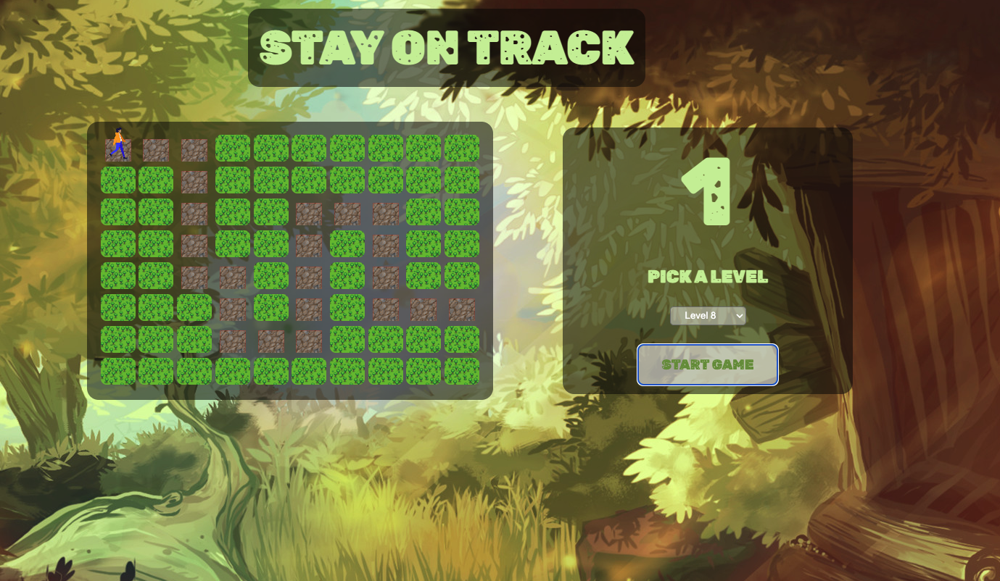

# Stay On Track 

## Description

Stay On Track is a memorizing game built with HTML, CSS and JS.

## How to play

When you click start, you have 6 seconds to memorize the shown path. After that, you will to get to the end of the path while staying on track. 
I you step next to the tiles shown before, you los.

To move the player, use arrow keys.

## Demo

https://maktooob.github.io/stay_on_track/

## Further Improvements

- add Button to go to next level, when winning
- make the path generate automatically
- give score based on how fast the player solves the level
- styling improvements
- sound effects
- animating the tiles when stepping on it
- responsive